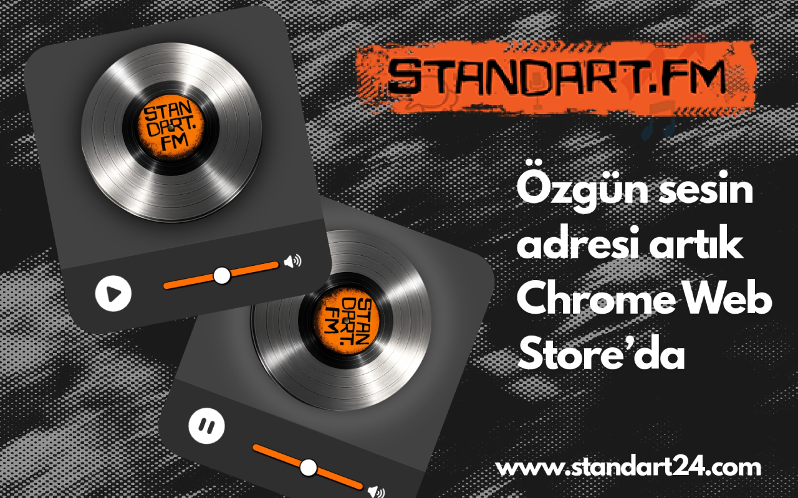

# Standart FM - Chrome Extension
A simple Chrome extension to play Standart FM radio directly from your browser.


## Requirements
- Chrome v88 or higher

## Setup
1. **Download the extension**
   - Clone the repository:  
     ```bash
     git clone https://github.com/mekanxsari/standart-fm.git
     ```
     Or download the ZIP and extract it to a folder.

2. **Open Chrome Extensions Page**
   - Go to `chrome://extensions/` in your Chrome browser.

3. **Enable Developer Mode**
   - Toggle the **Developer mode** switch at the top-right corner.  
   - This allows you to load local extensions that are not from the Chrome Web Store.

4. **Load the extension**
   - Click **Load unpacked** and select the folder where you downloaded/cloned the extension.

5. **Start using Standart FM**
   - The extension icon will appear in the toolbar. Click it to open and play radio.
